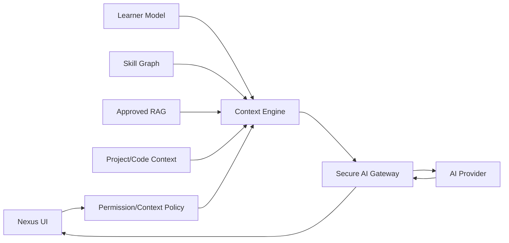

# Nexus AI — Current/Target Boundary

Current runtime contains a minimal structured context foundation only. It has no production LLM gateway, Learner Model, Skill Graph, RAG or Recommendation Engine.

Target research flow:

Target rule: use the minimum permitted context and never place account/session/provider secrets into prompts.
