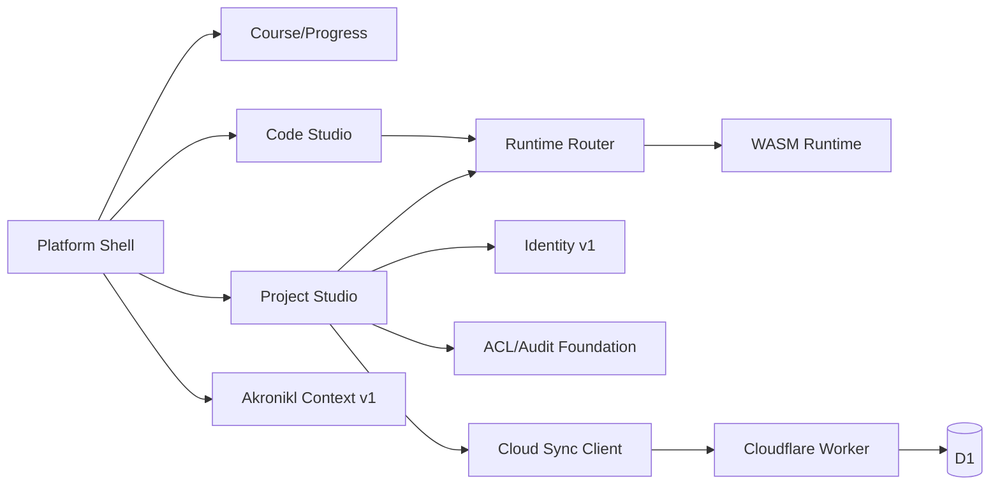

# C4 Component — Current `v0.1.7-alpha.2.2.1`

```mermaid
flowchart LR
    APP["Platform Shell"]
    LEARN["Course/Progress"]
    CODE["Code Studio"]
    RT["Runtime Router"]
    WASM["WASM Runtime"]
    PS["Project Studio"]
    ID["Identity v1"]
    ACL["ACL/Audit Foundation"]
    SYNC["Cloud Sync Client"]
    WORKER["Cloudflare Worker"]
    D1[("D1")]
    CTX["Akronikl Context v1"]

    APP --> LEARN
    APP --> CODE
    APP --> PS
    APP --> CTX
    CODE --> RT
    PS --> RT
    RT --> WASM
    PS --> ID
    PS --> ACL
    PS --> SYNC
    SYNC --> WORKER
    WORKER --> D1
```

No production AI gateway is part of this current component diagram.
