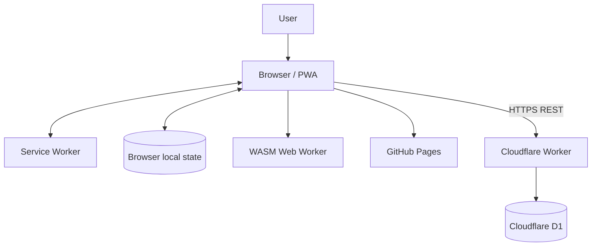

# Deployment — Current `v0.1.7-alpha.2.2.1`

```mermaid
flowchart TB
    U["User"]
    B["Browser / PWA"]
    SW["Service Worker"]
    L[("Browser local state")]
    WW["WASM Web Worker"]
    GH["GitHub Pages"]
    W["Cloudflare Worker"]
    D1[("Cloudflare D1")]

    U --> B
    B --> GH
    B <--> SW
    B <--> L
    B --> WW
    B -->|HTTPS REST| W
    W --> D1
```

Current production cloud storage is D1-only. R2, Durable Objects, external IdP and AI providers are not current deployment dependencies.
