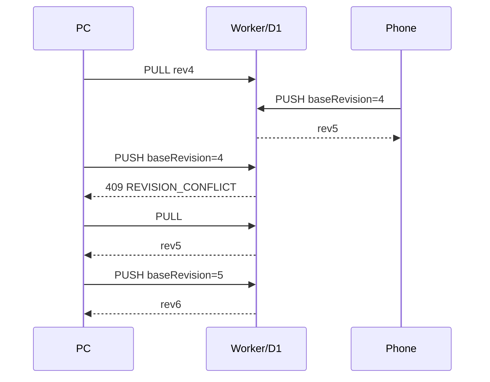

# Sequence Diagrams — Current and Target

## Conflict recovery — current

```mermaid
sequenceDiagram
    participant PC
    participant Cloud as Worker/D1
    participant Phone

    PC->>Cloud: PULL rev4
    Phone->>Cloud: PUSH baseRevision=4
    Cloud-->>Phone: rev5
    PC->>Cloud: PUSH baseRevision=4
    Cloud-->>PC: 409 REVISION_CONFLICT
    PC->>Cloud: PULL
    Cloud-->>PC: rev5
    PC->>Cloud: PUSH baseRevision=5
    Cloud-->>PC: rev6
```

## Identity v2 — target candidate

Federated sign-in/passkey flows are PLANNED and will be frozen only in WORK05.
