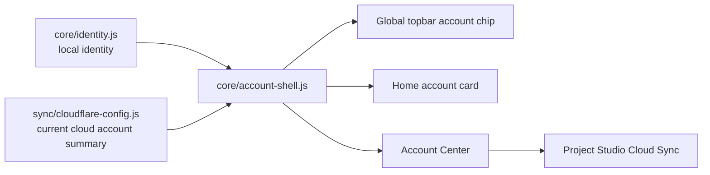

# Nexus Account Shell v1 — Architecture

**Release:** `v0.1.7-alpha.2.4.1`  
**Дата:** 2026-09-26  
**Status:** IMPLEMENTED FOUNDATION

## Purpose

Первый runtime-шаг после Architecture & AI Research Baseline.

Account Shell выводит identity state из технического Cloud Sync контура в глобальный интерфейс Nexus.

## Current flow

## Important boundary

Account Shell **does not** read or render the raw Nexus Cloud token.

It uses only:
- connected state;
- display name;
- subject reference;
- Worker host;
- local device id.

## Current states
- `local-only`
- `cloud-unconfigured`
- `cloud-linked`

## Current sign-in method
`Nexus Cloud Token` remains an alpha migration bridge.

## Planned Identity v2
Displayed only as PLANNED:
- Yandex ID
- Google
- Apple
- Phone / OTP
- Passkey

The UI does not claim those providers are operational.
