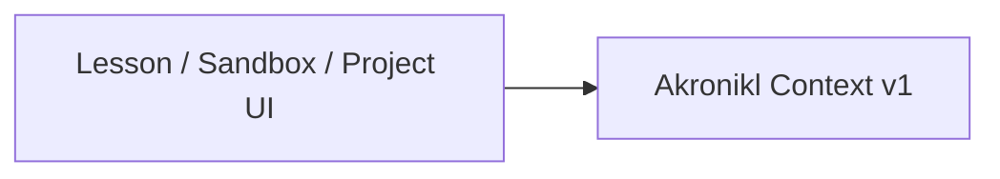
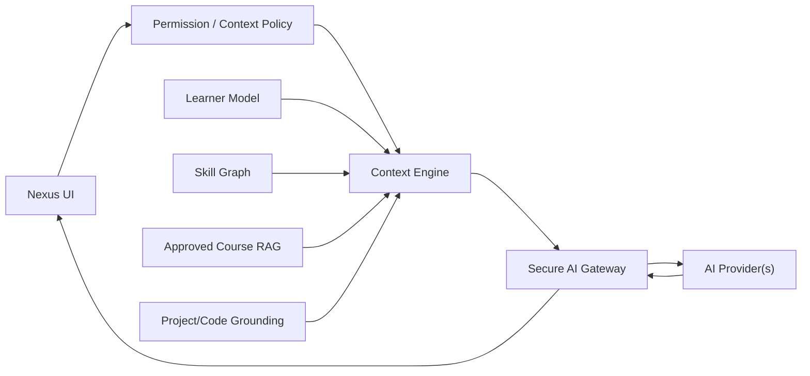

# Архитектура Akronikl / Nexus AI

**Runtime basis:** `v0.1.7-alpha.2.2.1`  
**Architecture baseline:** `v0.1.7-alpha.2.3` WORK03

## Current state — FOUNDATION

Production runtime currently contains only client-side contextual foundation (`akronikl/context.js`). It does **not** contain a production LLM gateway or RAG pipeline.

Current context is intended to keep assistant integration structured rather than scrape arbitrary page state.

## Target research architecture — RESEARCH/PLANNED

## Security principles

Forbidden:
- API/provider secret in `index.html`, JS bundle or public repository;
- account/session token in prompt;
- blind upload of all DOM/localStorage/project files;
- model-direct access to infrastructure credentials;
- unrestricted shell execution;
- AI overriding Worker ACL decisions.

## Research principle

The target assistant is not accepted merely because it can chat. It must be evaluated against Generic LLM baseline under AIR-001..014.

## Offline fallback

Static explanations, diagnostics, local heuristics and course content should remain usable without a cloud AI provider where practical.
