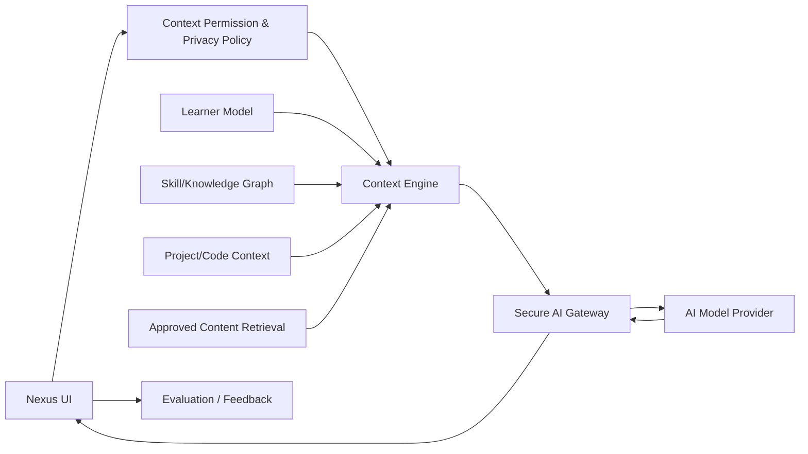

# Nexus AI — Current/Target Boundary

## Current — FOUNDATION only

В `v0.1.7-alpha.2.2.1` существует `akronikl/context.js`.

Current context может содержать:
- `courseId`;
- `lessonId`;
- `sectionId`;
- `taskId`;
- `code`;
- `stdin`;
- `stdout`;
- `stderr`;
- `attempts`;
- `language`;
- user preferences relevant to mentor context.

**Current runtime не содержит production LLM gateway, RAG, Learner Model или Recommendation Engine.**

## Target — RESEARCH / PLANNED

## Trust rule

AI must not get implicit access to all Nexus data.

Target flow:
1. user action defines purpose;
2. permission/context policy selects allowed fields;
3. minimal context is assembled;
4. secrets/tokens are stripped;
5. gateway sends only permitted payload;
6. response is evaluated/logged without exposing secrets.

## Research boundary

Questions AIR-001..014 are not resolved by architecture diagrams alone. They require controlled experiments.

Particularly important:
- how much learner state is necessary;
- whether graph/RAG/project context improves outcomes;
- whether extra context causes noise or privacy cost;
- which metrics correlate with actual learning.

## Prohibited target anti-patterns

- API keys in public JS/localStorage;
- sending entire localStorage/DOM;
- sending account/session tokens into prompts;
- model-direct infrastructure credentials;
- AI deciding server ACL;
- model executing unrestricted shell on production infrastructure.
