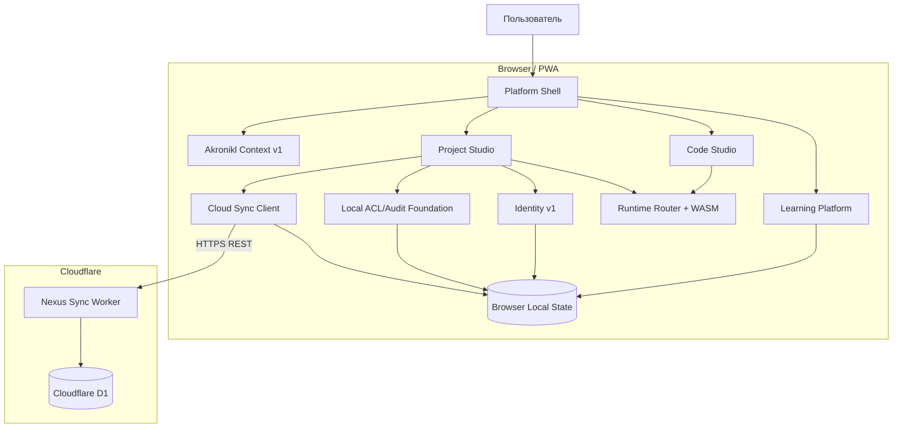

# AKRONIKL IT NEXUS — Architecture Baseline

**Документационный этап:** `v0.1.7-alpha.2.3` WORK03  
**Runtime baseline:** `v0.1.7-alpha.2.2.1`  
**Дата:** 2026-09-26  
**Нормативный язык:** русский  
**Статус:** WORK03 COMPLETE

## 1. Назначение

Этот документ фиксирует архитектурный baseline AKRONIKL IT NEXUS после закрытия Cloud Sync LIVE PASS и Requirements Baseline WORK02.

Архитектура описывается по фактическому состоянию runtime `v0.1.7-alpha.2.2.1`. Планируемые и исследовательские компоненты не считаются реализованными и маркируются отдельно.

Источники истины:

1. фактический код `v0.1.7-alpha.2.2.1`;
2. D1 migrations `0001`–`0003`;
3. Cloud Sync LIVE evidence;
4. WORK02 Requirements Baseline;
5. существующие ADR и release records.

## 2. Правило статусов

- `IMPLEMENTED` — существует в runtime и подтверждено кодом/тестом/LIVE evidence;
- `FOUNDATION` — основа есть, пользовательский/операционный контур неполон;
- `PLANNED` — утверждено как целевое направление, реализации нет;
- `RESEARCH` — требуется исследование до design freeze;
- `DEPRECATED` — документ/решение больше не отражает целевое состояние.

## 3. Архитектурные слои current baseline

## 4. Что уже является системой

### Learning Platform — IMPLEMENTED
- Platform Shell;
- каталог курсов;
- C++ reference course;
- локальный прогресс;
- PWA;
- учебные лаборатории и практикумы.

### Engineering Workspace — IMPLEMENTED
- Code Studio;
- multi-file workspace;
- Runtime Router;
- Browser/WASM provider model;
- compiler/runtime diagnostics;
- Project Studio;
- checkpoints;
- milestones;
- persistent project entity.

### Cloud Engineering Layer — IMPLEMENTED / FOUNDATION
- Nexus Account bootstrap/token auth — FOUNDATION;
- project PUSH/PULL — IMPLEMENTED;
- D1-only snapshots — IMPLEMENTED;
- optimistic concurrency — IMPLEMENTED;
- conflict rejection/recovery — IMPLEMENTED;
- server-side ACL — FOUNDATION;
- audit — IMPLEMENTED for current sync path;
- team UX/invites — FOUNDATION.

### Intelligent Learning Layer — FOUNDATION / RESEARCH
- minimal Akronikl Context Model — FOUNDATION;
- Learner Model — RESEARCH;
- Skill/Knowledge Graph — RESEARCH;
- RAG — RESEARCH;
- Recommendation Engine — RESEARCH;
- LLM orchestration — RESEARCH.

## 5. Главные архитектурные границы

1. **Browser не является источником серверных прав.** Cloud authorization решает Worker.
2. **D1 является текущим production storage Cloud Sync.** R2 не является обязательной частью current runtime.
3. **Local revision и cloud revision независимы.**
4. **Push использует optimistic concurrency через `baseRevision`.**
5. **AI current и AI target должны быть явно разделены.**
6. **Long-lived Nexus token в localStorage — временный alpha debt, а не target Identity model.**
7. **Course content не должен зависеть от полной DOM-структуры Platform Shell.**
8. **Runtime provider выбирается через language-neutral contract.**

## 6. Архитектурные документы WORK03

- `C4_COMPONENT_CURRENT_v0.1.7-alpha.2.2.1.md`
- `DEPLOYMENT_CURRENT_v0.1.7-alpha.2.2.1.md`
- `DATA_FLOW_DIAGRAM_CURRENT_v0.1.7-alpha.2.2.1.md`
- `SEQUENCE_BOOTSTRAP_CURRENT.md`
- `SEQUENCE_CLOUD_SYNC_CURRENT.md`
- `SEQUENCE_REVISION_CONFLICT_RECOVERY.md`
- `SEQUENCE_IDENTITY_V2_TARGET.md`
- `API_CATALOG_CURRENT.md`
- `CURRENT_VS_TARGET_ARCHITECTURE.md`
- `ARCHITECTURE_STATUS_MATRIX.md`
- `AI_BOUNDARY_CURRENT_TARGET.md`
- `TRUST_BOUNDARIES_CURRENT_TARGET.md`
- `ARCHITECTURE_DECISION_INDEX_WORK03.md`

## 7. Следующий архитектурный gate

WORK04 должен зафиксировать полную модель данных:

- production D1 Data Dictionary;
- current ERD cleanup;
- target Identity schema;
- target Learning/Skill/AI event schema;
- migration/versioning policy.

Runtime version до закрытия всего `v0.1.7-alpha.2.3` baseline не повышается.
