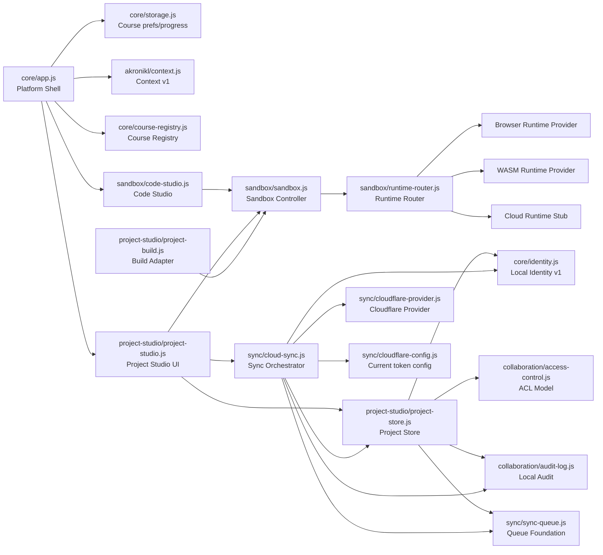
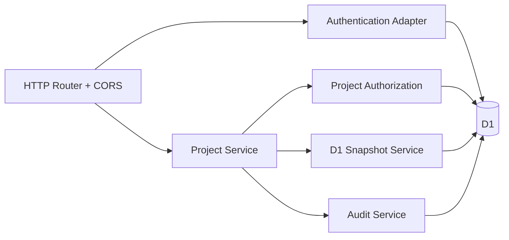

# C4 Component — Current Runtime `v0.1.7-alpha.2.2.1`

**Status:** IMPLEMENTED/FOUNDATION по компонентам.

## Browser / PWA container

## Cloudflare Worker container

## Component responsibility

| Component | Responsibility | Status |
|---|---|---|
| Platform Shell | route/render/bind, main UI | IMPLEMENTED |
| Course Registry/Storage | content loading, local course state | IMPLEMENTED |
| Code Studio | editor/VFS UX | IMPLEMENTED |
| Runtime Router | capability-based provider selection | IMPLEMENTED |
| WASM Runtime | C++ compilation/execution in browser worker | IMPLEMENTED |
| Project Studio | persistent engineering project UX | IMPLEMENTED |
| Local Identity v1 | device/local principal/account link fields | FOUNDATION |
| Local ACL | role/path policy model | FOUNDATION |
| Local Audit | browser-side append log | FOUNDATION |
| Cloud Sync | explicit PUSH/PULL orchestration | IMPLEMENTED |
| Sync Queue | queued sync model | FOUNDATION |
| Worker AuthN | nexus-token | FOUNDATION |
| Worker AuthZ | role + scope + explicit DENY | FOUNDATION |
| D1 snapshots/revisions | current Cloud project persistence | IMPLEMENTED |
| Akronikl Context v1 | minimal contextual payload | FOUNDATION |
| Full Nexus AI | — | RESEARCH/PLANNED |
