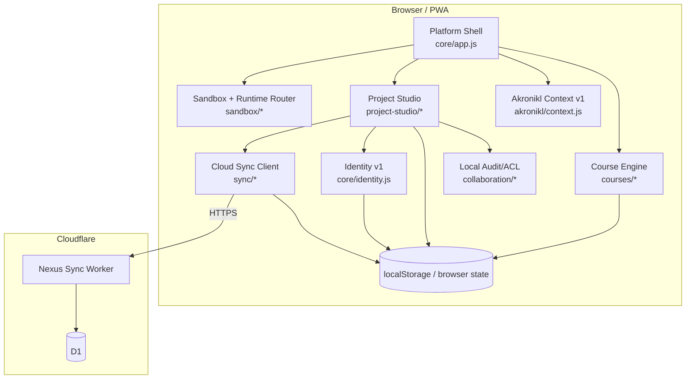

# C4 Container — Current Baseline v0.1.7-alpha.2.2.1

```mermaid
flowchart TB
    subgraph Browser["Browser / PWA"]
      Shell["Platform Shell\ncore/app.js"]
      Course["Course Engine\ncourses/*"]
      Sandbox["Sandbox + Runtime Router\nsandbox/*"]
      Studio["Project Studio\nproject-studio/*"]
      Identity["Identity v1\ncore/identity.js"]
      Sync["Cloud Sync Client\nsync/*"]
      Audit["Local Audit/ACL\ncollaboration/*"]
      Local[(localStorage / browser state)]
      Akronikl["Akronikl Context v1\nakronikl/context.js"]
    end

    subgraph Cloud["Cloudflare"]
      Worker["Nexus Sync Worker"]
      D1[(D1)]
    end

    Shell --> Course
    Shell --> Sandbox
    Shell --> Studio
    Shell --> Akronikl
    Studio --> Identity
    Studio --> Audit
    Studio --> Sync
    Course --> Local
    Studio --> Local
    Identity --> Local
    Sync --> Local
    Sync -->|HTTPS| Worker
    Worker --> D1
```

## Current architectural boundary
AI Provider в эту current diagram намеренно не включён: production AI gateway ещё не реализован.
