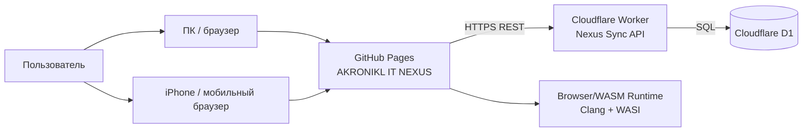

# C4 Context — Current Baseline v0.1.7-alpha.2.2.1

**Status: IMPLEMENTED + verified where marked LIVE.**

## Проверенные связи
- GitHub Pages → Worker: LIVE PASS.
- Worker → D1: LIVE PASS.
- PC → Cloud → iPhone: LIVE PASS.
- iPhone → Cloud → PC: LIVE PASS.
- browser → WASM C++ runtime: regression/runtime tests PASS.

## Пока отсутствует в current context
- полноценный external Identity Provider;
- AI provider/gateway;
- SMS provider;
- email provider;
- admin backend;
- production monitoring/observability service.

Они должны появляться на target C4 только после отдельного архитектурного решения.
