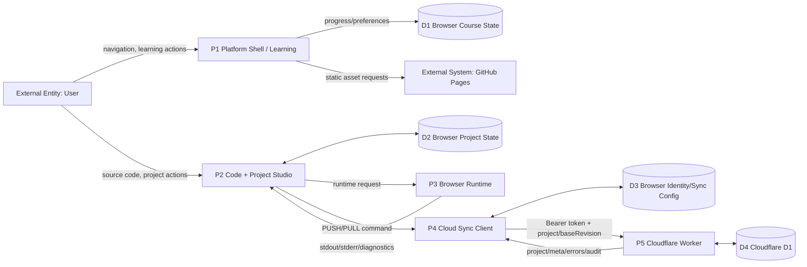

# Data Flow Diagram — Current `v0.1.7-alpha.2.2.1`

## Level 1

## Data classes

### Browser-only current data
- course preferences;
- course progress;
- project local state;
- local audit;
- device/local identity;
- current Cloud Sync config/token.

### Cloud current data
- account subject;
- token hash + metadata;
- workspaces/memberships;
- project metadata;
- project snapshots/revisions/checkpoints;
- project ACL/invites foundation;
- server audit events.

## Sensitive flows

1. Nexus token: Browser → Worker in `Authorization: Bearer`.
2. Bootstrap secret: Browser → Worker only during first account bootstrap.
3. Project source: Browser → Worker → D1 on explicit PUSH.
4. Project source: D1 → Worker → Browser on explicit PULL.

## Current privacy limitation

Cloud project source is uploaded only when the user explicitly enables/sends Cloud Sync. Full learning telemetry is not yet a production cloud stream.
