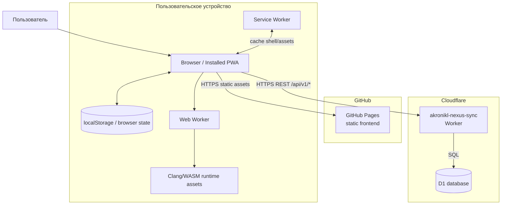

# Deployment Architecture — Current `v0.1.7-alpha.2.2.1`

## Current deployment facts

- Frontend — статическая PWA на GitHub Pages.
- Runtime C++ выполняется в браузерном Worker/WASM-контуре.
- Cloud Sync API — Cloudflare Worker.
- Cloud metadata, revisions, snapshots, account token hashes и audit — Cloudflare D1.
- Project snapshot limit — `1,500,000` bytes.
- Production storage mode Worker — `d1-only`.
- Current auth mode — `nexus-token`.

## Не входит в current deployment

- R2 как обязательное snapshot storage;
- Durable Objects;
- Queues;
- внешний OAuth/OIDC IdP;
- SMS gateway;
- AI gateway/provider;
- admin backend.

Эти элементы могут появиться только как отдельные target decisions.
