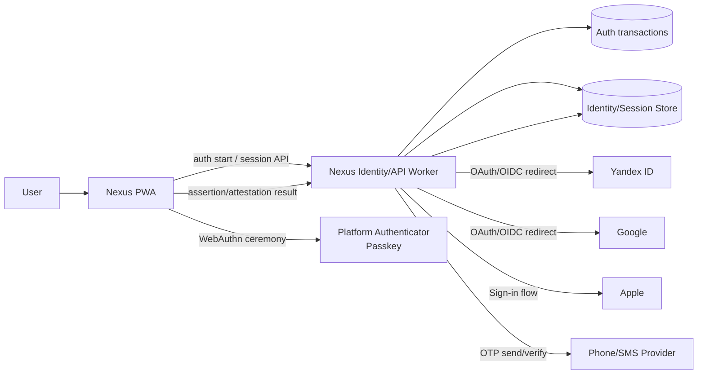

# Nexus Identity v2 — Target Architecture

**Status: PLANNED / DESIGN FROZEN AT ARCHITECTURE LEVEL.**  
Provider-specific implementation details remain implementation tasks.



## Server-side responsibilities

Identity Worker/BFF owns:
- provider state/nonce/PKCE transaction;
- authorization code exchange;
- provider subject validation;
- account resolve/link;
- session issue/rotate/revoke;
- passkey registration/authentication verification;
- MFA policy;
- recovery;
- security audit;
- rate/abuse controls.

## Browser responsibilities

Browser owns:
- user intent;
- redirects;
- WebAuthn browser API;
- displaying account/session state;
- CSRF token header when required;
- no provider/client secret storage.

## Provider abstraction

Target interface concept:

```text
IdentityProviderAdapter
- id
- startAuthorization()
- verifyCallback()
- normalizeIdentity()
- unlinkPolicy()
```

Provider identities resolve to stable `(provider, provider_subject)`.

Email is an attribute, not the canonical cross-provider identity key.
