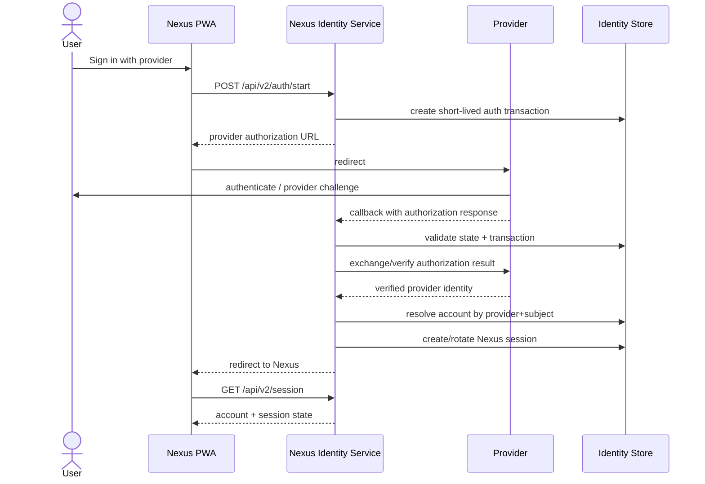
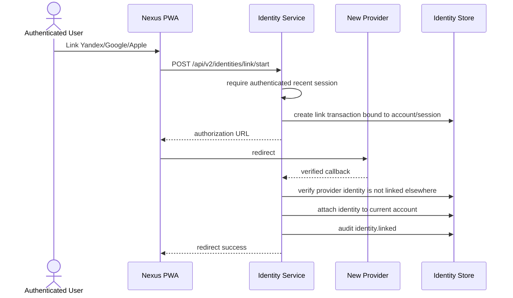
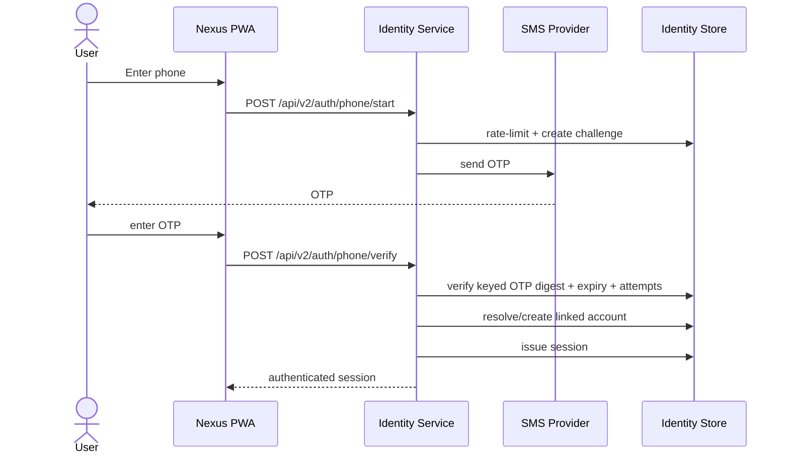
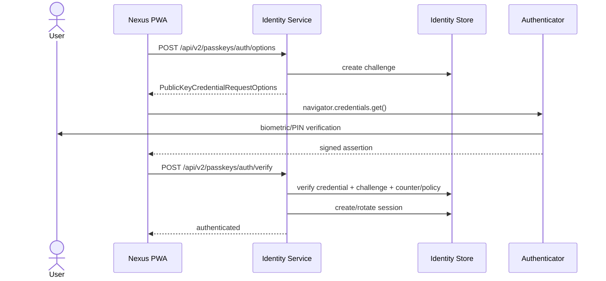

# Nexus Identity v2 — Sequence Flows

## Federated sign-in

```mermaid
sequenceDiagram
    actor U as User
    participant B as Nexus PWA
    participant N as Nexus Identity Service
    participant P as Provider
    participant D as Identity Store

    U->>B: Sign in with provider
    B->>N: POST /api/v2/auth/start
    N->>D: create short-lived auth transaction
    N-->>B: provider authorization URL
    B->>P: redirect
    P->>U: authenticate / provider challenge
    P-->>N: callback with authorization response
    N->>D: validate state + transaction
    N->>P: exchange/verify authorization result
    P-->>N: verified provider identity
    N->>D: resolve account by provider+subject
    N->>D: create/rotate Nexus session
    N-->>B: redirect to Nexus
    B->>N: GET /api/v2/session
    N-->>B: account + session state
```

## Link a new provider to an existing account

```mermaid
sequenceDiagram
    actor U as Authenticated User
    participant B as Nexus PWA
    participant N as Identity Service
    participant P as New Provider
    participant D as Identity Store

    U->>B: Link Yandex/Google/Apple
    B->>N: POST /api/v2/identities/link/start
    N->>N: require authenticated recent session
    N->>D: create link transaction bound to account/session
    N-->>B: authorization URL
    B->>P: redirect
    P-->>N: verified callback
    N->>D: verify provider identity is not linked elsewhere
    N->>D: attach identity to current account
    N->>D: audit identity.linked
    N-->>B: redirect success
```

## Phone OTP

```mermaid
sequenceDiagram
    actor U as User
    participant B as Nexus PWA
    participant N as Identity Service
    participant S as SMS Provider
    participant D as Identity Store

    U->>B: Enter phone
    B->>N: POST /api/v2/auth/phone/start
    N->>D: rate-limit + create challenge
    N->>S: send OTP
    S-->>U: OTP
    U->>B: enter OTP
    B->>N: POST /api/v2/auth/phone/verify
    N->>D: verify keyed OTP digest + expiry + attempts
    N->>D: resolve/create linked account
    N->>D: issue session
    N-->>B: authenticated session
```

## Passkey sign-in

```mermaid
sequenceDiagram
    actor U as User
    participant B as Nexus PWA
    participant N as Identity Service
    participant D as Identity Store
    participant A as Authenticator

    B->>N: POST /api/v2/passkeys/auth/options
    N->>D: create challenge
    N-->>B: PublicKeyCredentialRequestOptions
    B->>A: navigator.credentials.get()
    A->>U: biometric/PIN verification
    A-->>B: signed assertion
    B->>N: POST /api/v2/passkeys/auth/verify
    N->>D: verify credential + challenge + counter/policy
    N->>D: create/rotate session
    N-->>B: authenticated
```
