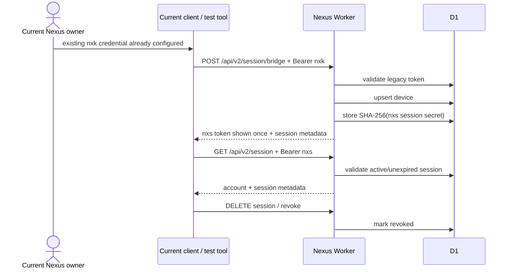

# Identity v2 Session Foundation — Current

**Release:** `v0.1.7-alpha.2.4.2`  
**Status:** FOUNDATION / IMPLEMENTED SERVER LAYER

## What becomes real in this release

The Cloudflare Worker now supports a second credential family:

```text
nxk_...  -> legacy Nexus token (migration source)
nxs_...  -> revocable short-lived Nexus session (foundation)
```

D1 adds:
- `account_devices`;
- `account_sessions`;
- `identity_security_events`.

## Authentication flow



## Compatibility

Existing `/api/v1/*` Cloud Sync endpoints continue accepting `nxk_...`.
They can also authenticate a valid `nxs_...` session because the central server authenticator now recognizes both credential families.

## Browser boundary

The frontend does **not** automatically create or persist `nxs_...` in this release.

Reason:
current `github.io -> workers.dev` deployment is not the final first-party cookie environment from WORK05.

The Account Center only checks the public server capability endpoint and reports whether the foundation is deployed.

## Migration bridge

`POST /api/v2/session/bridge` is protected by:

```text
IDENTITY_V2_BRIDGE_ENABLED=true|false
```

Recommended production-alpha state after first deploy:

```text
false
```

Enable only for an intentional migration/session lifecycle test.
