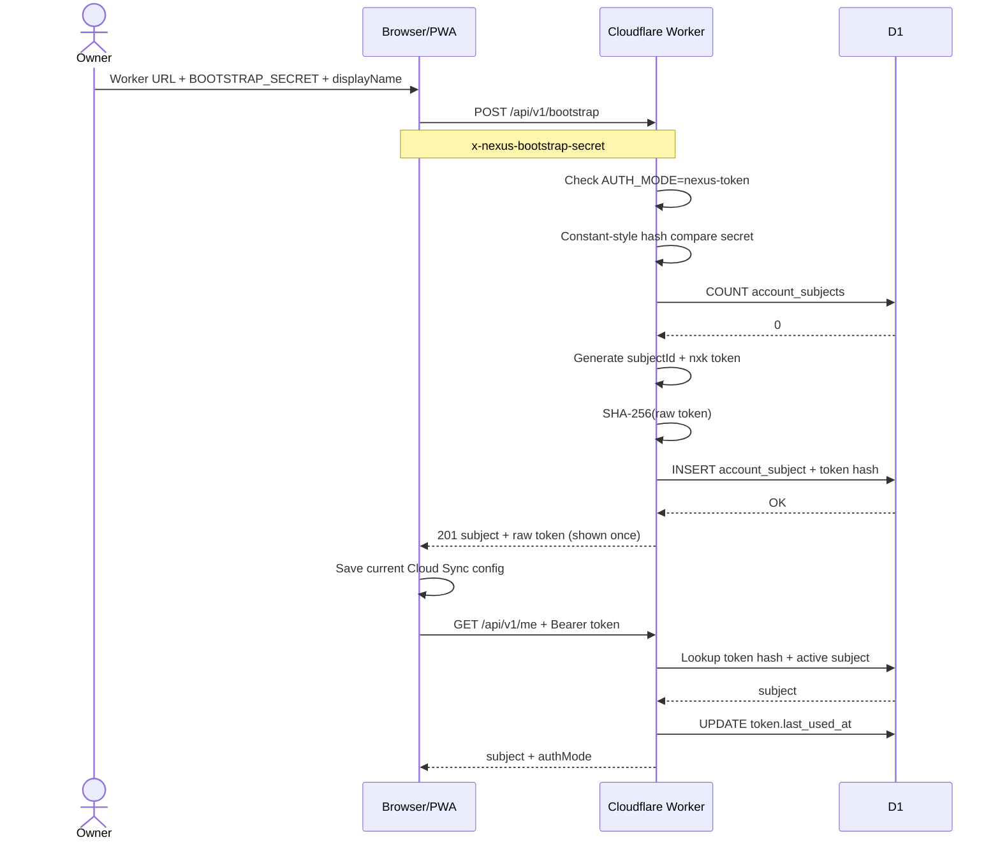

# Sequence — Current Nexus Account Bootstrap

**Status:** IMPLEMENTED and LIVE verified.

## Security notes

- Worker stores token hash, not raw token.
- Bootstrap closes after the first account exists.
- `BOOTSTRAP_SECRET` is a Worker secret and must not be committed.
- Current browser storage of the long-lived `nxk_...` token is `FOUNDATION` debt and must be replaced by Identity v2 session design.
