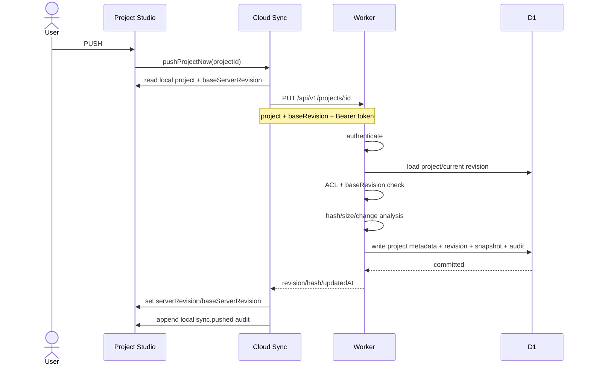
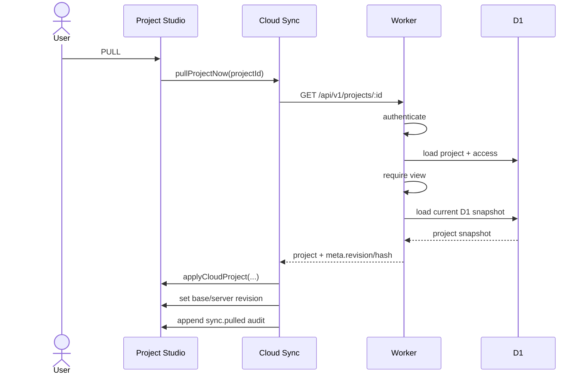

# Sequence — Current Cloud Sync PUSH/PULL

**Status:** IMPLEMENTED and LIVE verified.

## PUSH

## PULL

## Invariants

- PULL does not infer ownership from client UI.
- Existing project PUSH must match server `current_revision`.
- Snapshot size must be ≤ 1,500,000 bytes.
- Server authorization is checked before applying changes.
