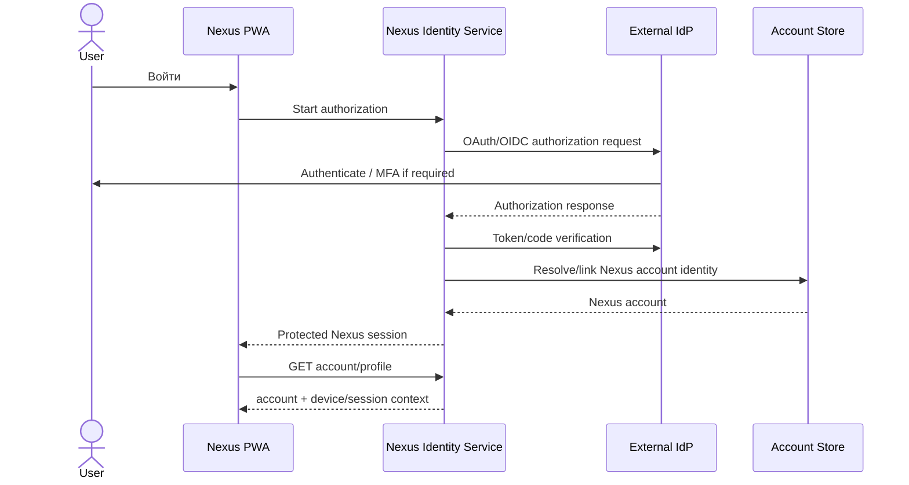
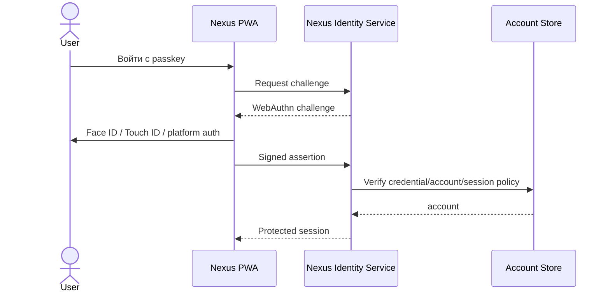

# Sequence — Identity v2 Target Candidate

**Status:** PLANNED.  
**Не является implementation contract.** Финальный design принимается в WORK05 Identity & Security Design.

## Candidate federated sign-in

## Candidate passkey sign-in

## Target properties

- user should not manually copy long-lived account tokens;
- multiple identities may be linked to one Nexus account;
- sessions/devices must be revocable;
- MFA/passkeys must be supported by the security model;
- browser JS must not receive provider client secrets;
- exact cookie/token model is not frozen in WORK03.
