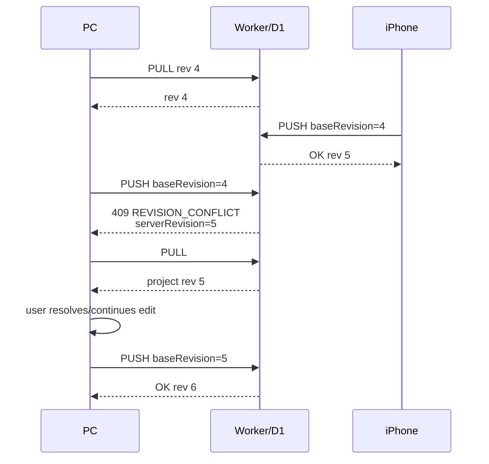

# Sequence — Revision Conflict and Recovery

**Status:** IMPLEMENTED and LIVE verified on PC ↔ iPhone.

## Architectural meaning

Optimistic concurrency prevents a stale client from silently overwriting a newer cloud state.

Current recovery is explicit:
1. detect conflict;
2. PULL current cloud state;
3. continue/reapply local change;
4. PUSH from the new base revision.

Automatic three-way merge is **not** current functionality and remains a future research/product decision.
