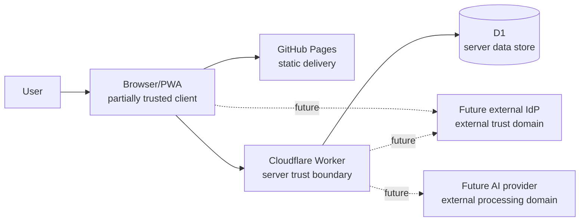

# Trust Boundaries — Current and Target

## TB-1 Browser ↔ Worker

Browser can request an operation but cannot grant itself server access.

Worker must:
- authenticate;
- resolve project membership;
- evaluate role/path/action;
- apply explicit DENY priority;
- validate revision and payload limits.

## TB-2 Worker ↔ D1

D1 is current server persistence boundary.

Server code owns:
- generated revision numbers;
- snapshot storage;
- audit writes;
- token hash lookup;
- project authorization queries.

## TB-3 Browser local state

Current local state is durable user-device state, **not** a secure secret vault.

Therefore current long-lived Nexus token storage is accepted only as alpha foundation debt.

## TB-4 Future external identity

OAuth/OIDC/passkey design must validate issuer/audience/state/nonce/session binding as applicable. Exact provider integration is deferred to WORK05.

## TB-5 Future AI provider

AI provider is an external data-processing boundary. Context minimization, user permission, retention policy, redaction and provider contract must be defined before production use.
