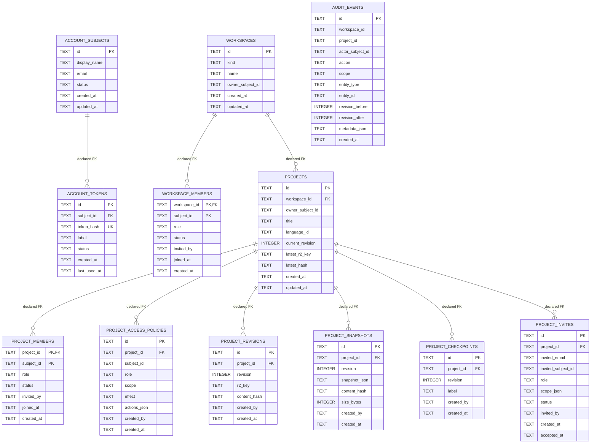

# ER Diagram — Current Production D1 `v0.1.7-alpha.2.2.1`

**Source of truth:** migrations `0001_sync_team_foundation.sql`, `0002_nexus_account_tokens.sql`, `0003_d1_only_project_snapshots.sql`.

## Logical references not declared as SQL FK

The following fields currently behave as logical subject references but are not consistently declared as FK:

- `workspaces.owner_subject_id`
- `workspace_members.subject_id`
- `workspace_members.invited_by`
- `projects.owner_subject_id`
- `project_members.subject_id`
- `project_members.invited_by`
- `project_access_policies.subject_id`
- `project_access_policies.created_by`
- `project_revisions.created_by`
- `project_snapshots.created_by`
- `project_checkpoints.created_by`
- `project_invites.invited_subject_id`
- `project_invites.invited_by`
- `audit_events.actor_subject_id`

WORK05 must decide which references become physical FK constraints and which remain application-owned identifiers.
