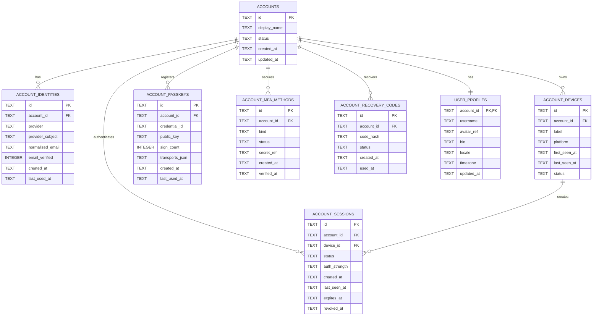

# ER Diagram — Target Identity v2 Draft

**Status: PLANNED / DESIGN DRAFT.**  
Not deployed. Final design belongs to WORK05.



## Provider identity rule

A federated identity should be unique by:

```text
(provider, provider_subject)
```

Email alone must not silently merge accounts.

Account linking requires an authenticated user action and provider verification.

## Candidate providers
- Yandex ID
- Google
- Apple
- phone OTP
- passkey/WebAuthn as credential type

Exact provider set and implementation can change in WORK05.
