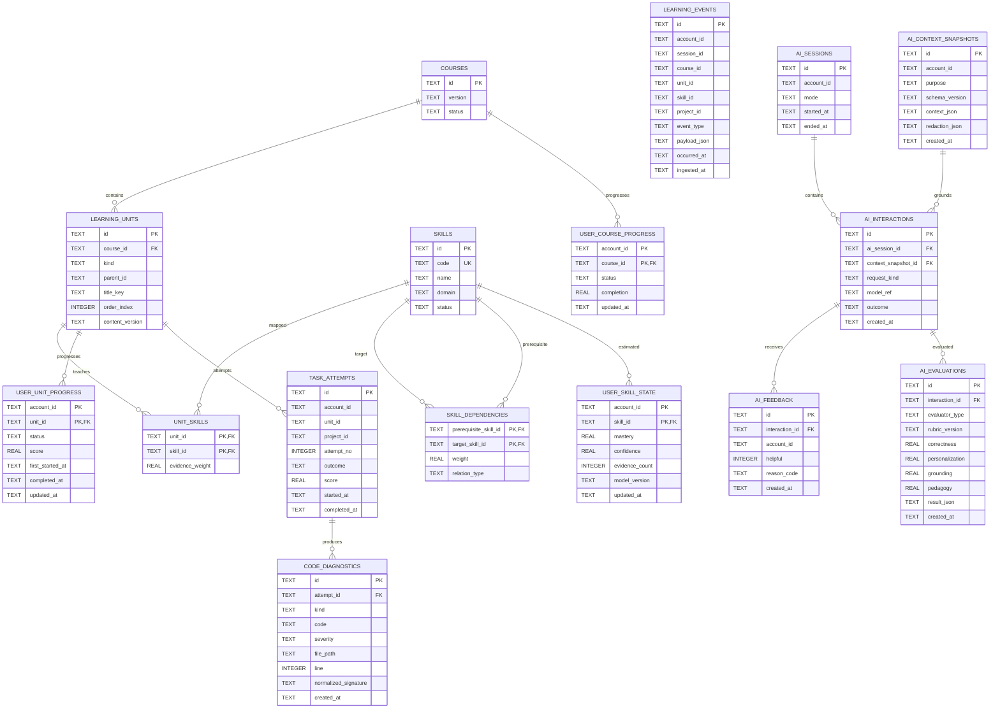

# ER Diagram — Target Learning / Skill / AI Data Draft

**Status: RESEARCH / PLANNED.**  
Entity boundaries are intentionally designed before implementation.

## Critical research rule

`USER_SKILL_STATE.mastery` is a derived estimate, not a ground-truth fact.

Its algorithm/version must be stored in `model_version` and evaluated experimentally.
