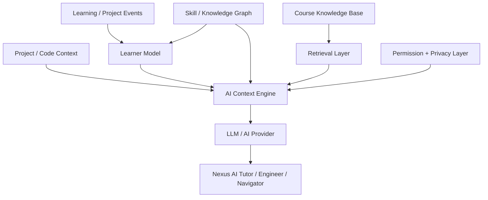

# AI Research Baseline — v0.1.7-alpha.2.3

**Status: RESEARCH.**  
Этот документ задаёт научно-техническую ось будущей дипломной работы.

## 1. Исследовательская проблема

Обычная LLM отвечает на учебный вопрос преимущественно из текста текущего запроса и общей истории диалога.

Для обучения программированию этого недостаточно: полезный наставник должен учитывать:
- фактический уровень освоения prerequisites;
- недавние ошибки;
- результаты задач;
- compiler/runtime diagnostics;
- текущий проект;
- историю исправлений;
- карту компетенций;
- разрешённый учебный контент.

## 2. Рабочая тема дипломного исследования

**Разработка системы персонализированного сопровождения обучения программированию на основе графа компетенций, анализа программного кода и больших языковых моделей.**

Формулировка рабочая и может уточняться по требованиям вуза.

## 3. Исследовательская гипотеза

Ответ AI, сформированный с использованием структурированного Learner Model + Skill/Knowledge Graph + Project Context + RAG, будет лучше generic-LLM baseline по совокупности измеримых критериев:

1. соответствие текущему уровню учащегося;
2. релевантность текущей теме/ошибке;
3. корректность привязки к пользовательскому коду;
4. снижение повторных ошибок;
5. повышение успешности следующего задания;
6. снижение числа лишних шагов/подсказок.

## 4. Целевая AI architecture

## 5. Baseline experiment

### System A — Generic LLM
`question → LLM → answer`

### System B — Nexus AI
`question + learner state + graph + RAG + project context → LLM → personalized answer`

## 6. Первичная система метрик

### Objective
- task success after hint;
- repeated-error rate;
- time-to-solution;
- number of hints before solution;
- compiler/test pass after intervention;
- prerequisite violation rate.

### Expert / rubric
- factual correctness;
- pedagogical appropriateness;
- personalization;
- code-context grounding;
- explanation clarity;
- hallucination rate.

## 7. Что требуется начать собирать заранее

Нормализованные learning events:

- `lesson.started`
- `lesson.completed`
- `task.started`
- `task.failed`
- `task.solved`
- `quiz.answered`
- `compiler.error`
- `runtime.error`
- `test.failed`
- `test.passed`
- `checkpoint.created`
- `project.changed`
- `project.synced`
- `ai.hint.requested`
- `ai.hint.feedback`

До утверждения privacy model данные не должны автоматически отправляться наружу.

## 8. Научная дисциплина

Для каждой AI-функции дальше требуется:
1. исследовательский вопрос;
2. baseline;
3. dataset/source;
4. метрика;
5. эксперимент;
6. результат;
7. ограничения;
8. reproducibility notes.

Таким образом Nexus AI проектируется не как «чат внутри сайта», а как исследуемая интеллектуальная система.
