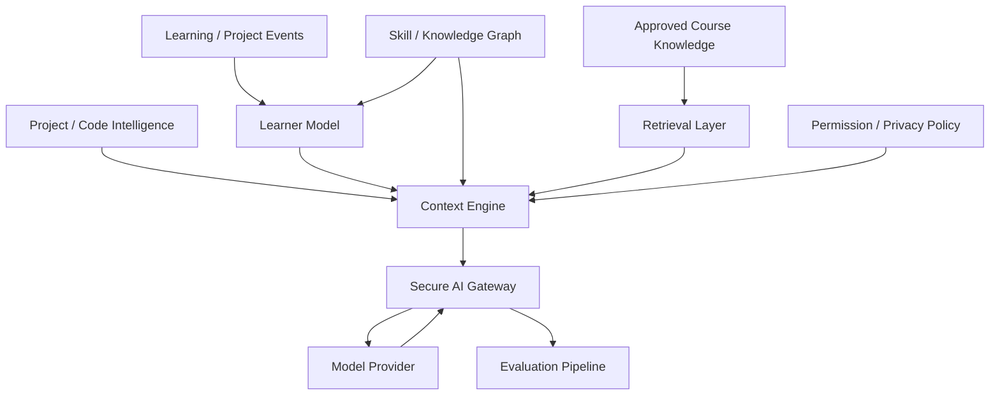

# AKRONIKL IT NEXUS — AI Research Charter

**Этап:** `v0.1.7-alpha.2.3` WORK06  
**Runtime baseline:** `v0.1.7-alpha.2.2.1`  
**Дата:** 2026-09-26  
**Статус:** WORK06 COMPLETE — RESEARCH DESIGN

## Научно-техническая цель

Nexus AI проектируется не как встроенный чат, а как интеллектуальная система персонализированного сопровождения обучения программированию.

Рабочая тема:

> **Разработка системы персонализированного сопровождения обучения программированию на основе графа компетенций, анализа программного кода и больших языковых моделей.**

## Базовое сравнение

### Generic LLM
`Question → LLM → Answer`

### Nexus AI
`Question + Learner Model + Skill Graph + RAG + Project/Code Context → Context Engine → LLM → Personalized Answer`

## Главная гипотеза

Структурированный учебный и проектный контекст должен повышать:
- соответствие уровню учащегося;
- релевантность текущей ошибке;
- grounding по курсу и коду;
- успешность следующего шага;

и снижать:
- повторные ошибки;
- число лишних подсказок;
- время до корректного решения;
- unsupported/hallucinated claims.

## Архитектура исследования

## Исследовательское правило

Каждая AI-функция должна иметь:
1. research question;
2. baseline;
3. Nexus variant;
4. dataset/sample;
5. metrics;
6. protocol;
7. result;
8. limitations;
9. reproducibility record.

WORK06 не фиксирует окончательно конкретный LLM/provider, embedding model, vector DB, Learner Model algorithm или recommendation algorithm.
