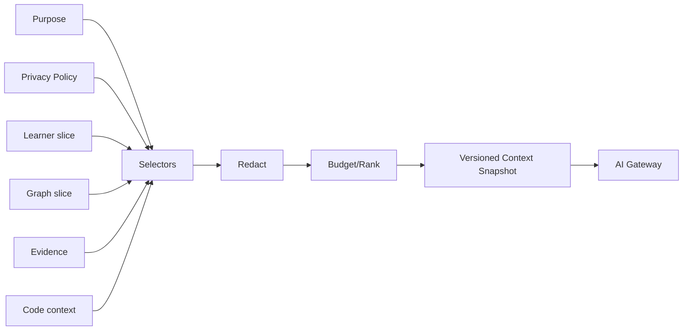

# Nexus AI Context Engine

Goal: собрать минимально достаточный контекст под конкретную AI-purpose.

Inputs:
- user query;
- AI mode;
- current learning unit;
- learner-model slice;
- skill-graph neighborhood;
- retrieved evidence;
- selected code/project context;
- allowed preferences.

Excluded by default:
- session/auth tokens;
- phone/email;
- recovery/MFA data;
- unrelated projects;
- entire localStorage;
- hidden admin data.

Snapshot stores schema/version/provenance/redaction/context size.
