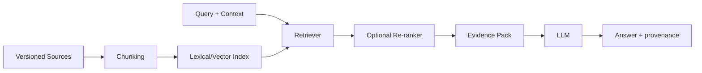

# RAG Research Plan

Sources:
- normative course lessons;
- approved practicums/tasks;
- official Nexus docs;
- curated examples;
- optionally separately labeled authoritative external corpus.

Experiments:
- lexical vs vector vs hybrid;
- chunk size/overlap;
- top-k;
- reranking;
- query expansion;
- course-only vs mixed corpus.

Metrics:
retrieval precision/recall, faithfulness, unsupported claims, task success, latency, context size.
