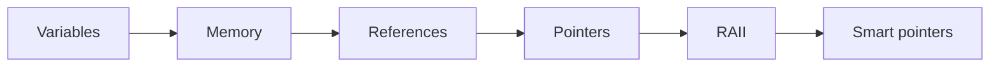

# Skill / Knowledge Graph Research Plan

Начинаем с вручную курируемого графа из curriculum и engineering concepts.

Edge types:
- prerequisite;
- reinforces;
- related.

Research:
1. graph-aware recommendation vs static curriculum;
2. prerequisite edge validation по task/event data;
3. candidate missing-edge discovery;
4. prerequisite violation rate.

Каждая версия графа хранит изменения и rationale.

Correlation сама по себе не превращает найденную связь в canonical prerequisite.
