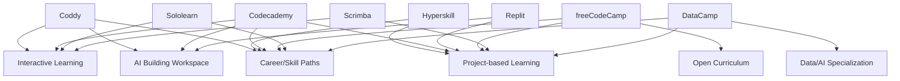

# Competitor Archetype Map

## Nexus target

Nexus intentionally sits at the intersection of:
- interactive learning;
- project-based learning;
- engineering workspace;
- cross-device project lifecycle;
- skill/mastery modeling;
- research-backed AI tutoring.

The intersection itself is the product hypothesis to validate.
